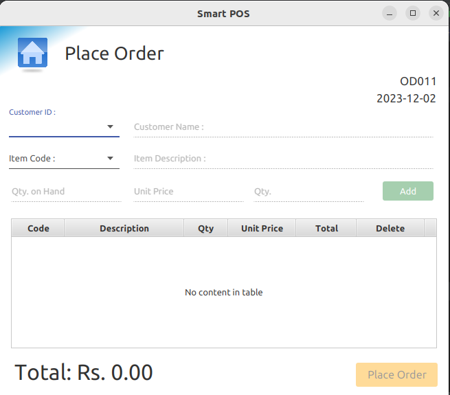

# Point of Sale (POS) System

This is a Java FX-based Point of Sale (POS) system developed as a project with the guidance of an instructor. It aims to provide a user-friendly interface for managing sales transactions, inventory, and generating reports.

## Features

- **User-friendly Interface**: Designed for ease of use and navigation.
- **Product Management**: Add, edit, and delete products from inventory.
- **Sales Management**: Process sales transactions, calculate totals, and generate receipts.
- **Inventory Management**: Keep track of available stock.


## Technologies Used

- **Java**: Core programming language.
- **Java FX**: GUI framework used for the interface.
- **PostgreSQL**: Database for storing product and transaction information.

## Getting Started

### Prerequisites

- Java Development Kit (JDK) installed
- IDE (Integrated Development Environment) compatible with Java (E.g., IntelliJ IDEA, Eclipse)

### Installation

1. Clone this repository to your local machine.
    ```
    git clone https://github.com/PubuduAriyawansha/pos-system
    ```

2. Open the project in your preferred IDE.

### Usage

1. Run the application.
2. Use the intuitive interface to manage products, process sales, and generate reports.
3. Explore different functionalities and features.

## Screenshots

Include screenshots here to visually demonstrate the application's interface and functionalities.




## Contributing

We welcome contributions! If you'd like to contribute to this project, please follow these steps:
1. Fork the repository.
2. Create a new branch (`git checkout -b feature/awesome-feature`).
3. Make your changes and commit them (`git commit -am 'Add some feature'`).
4. Push to the branch (`git push origin feature/awesome-feature`).
5. Create a pull request.

## License

This project is licensed under the [MIT License](License.txt).

## Acknowledgments

This project wouldn't have been possible without the invaluable support and guidance from various individuals and resources. I extend my heartfelt gratitude to:

- **Institute of software engineering**: For providing the platform and resources essential for learning and fostering an environment conducive to skill development.
  
- **Course Instructors**: I am immensely grateful for their expertise, patience, and unwavering support throughout this project. Their guidance has been instrumental in shaping the direction and understanding of this POS system.

- **Friends and Peers**: A special mention to my friends and peers who offered insights, encouragement, and assistance during the development of this project. Their collaboration and feedback were immensely valuable.

Their collective support and encouragement have been pivotal in the successful completion of this project.


## Contact

For any inquiries or feedback, feel free to reach out to pubuduariyawansa@gmail.com or open an issue in the repository.